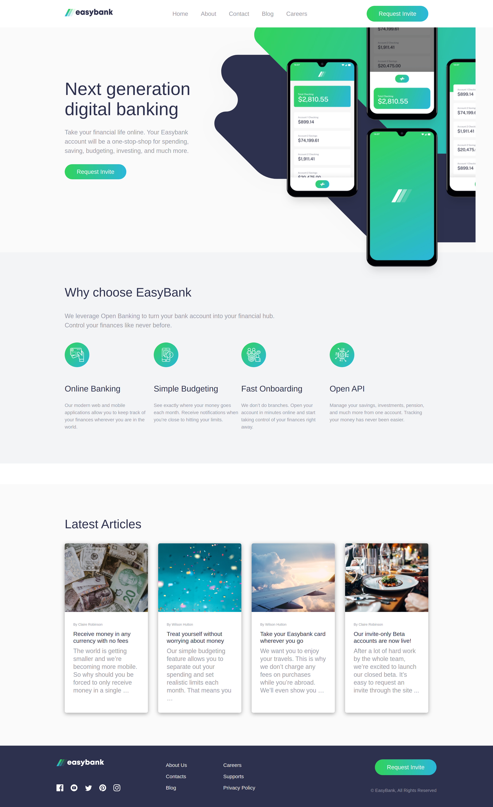
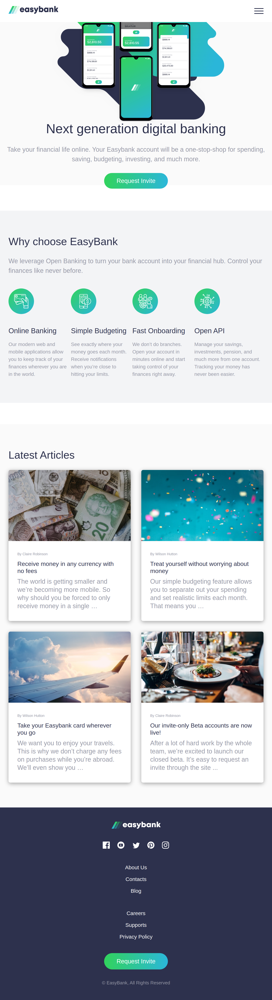
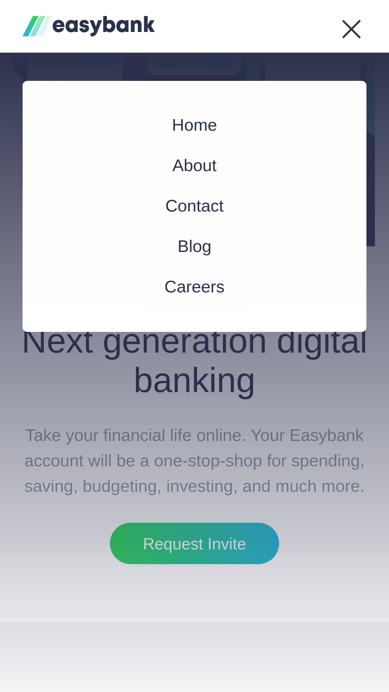

# Frontend Mentor - Easybank landing page solution

This is a solution to the [Easybank landing page challenge on Frontend Mentor](https://www.frontendmentor.io/challenges/easybank-landing-page-WaUhkoDN). Frontend Mentor challenges help you improve your coding skills by building realistic projects. 

## Table of contents

- [Overview](#overview)
  - [The challenge](#the-challenge)
  - [Screenshot](#screenshot)
  - [Links](#links)
- [My process](#my-process)
  - [Built with](#built-with)
  - [What I learned](#what-i-learned)
- [Author](#author)
- [Acknowledgments](#acknowledgments)

## Overview

### The challenge

Users should be able to:

- View the optimal layout for the site depending on their device's screen size
- See hover states for all interactive elements on the page

### Screenshot

Android

Desktop

iPad

MobNav

### Links

- Solution URL: [Github](https://github.com/mauryahdx/EasyBank)
- Live Site URL: [Github Pages](https://your-live-site-url.com)

## My process

### Built with

- Semantic HTML5 markup
- CSS custom properties
- Flexbox
- CSS Grid
- Mobile-first workflow
- [Sass](https://sass-lang.com/) - For styles

### What I learned

I have learnt the basics of sass and grid in the process of making this project 

## Author

- Surya Prakash Mourya 
- Frontend Mentor - [@mauryahdx](https://www.frontendmentor.io/profile/mauryahdx)
- Twitter - [@mauryahdx](https://www.twitter.com/mauryahdx)

## Acknowledgments

I would like to give special thanks to [Coder Coder](https://www.youtube.com/c/TheCoderCoder) YouTube Channel for this project. I have followed each and every step taught in her tutorial to make this project.

